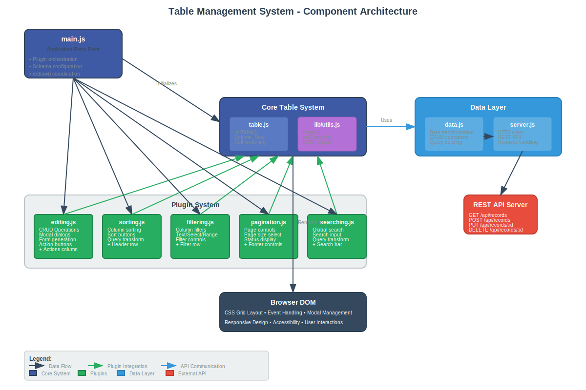

# Table Management System

A modular, plugin-based table component system with full CRUD functionality, built with vanilla JavaScript and CSS Grid.

## Architecture Overview

The system follows a **plugin-based architecture** where the core table functionality is extended through independent, composable plugins. This design promotes modularity, reusability, and maintainability.



*Component diagram showing the modular plugin-based architecture with data flow and integration points*

### Core Components

```
src/
├── main.js                 # Application entry point and orchestration
├── components/
│   ├── table.js           # Core table rendering and plugin system
│   ├── data.js            # Data transformation layer
│   ├── server.js          # API communication layer
│   ├── sorting.js         # Column sorting plugin
│   ├── filtering.js       # Column filtering plugin
│   ├── pagination.js      # Pagination controls plugin
│   ├── searching.js       # Global search plugin
│   └── editing.js         # CRUD operations plugin
├── lib/
│   ├── utils.js           # DOM utilities and helpers
│   └── sort.js            # Sorting utilities
└── style.css              # Complete styling system
```

## Plugin Pattern

Each feature is implemented as an independent plugin that can:

1. **Modify the schema** - Add columns, update properties
2. **Insert UI elements** - Add controls before/after the table
3. **Transform queries** - Modify API requests
4. **Handle interactions** - Respond to user events

### Plugin Interface

```javascript
function initPlugin(redraw, options) {
    const plugin = (schema) => {
        // Modify schema if needed
        schema.push({ name: 'newColumn', label: 'New Column' });
        
        // Create UI element
        const element = create('div', {}, 'Plugin UI');
        
        return { 
            type: 'before|after',  // Where to insert element
            element                // UI element to insert
        };
    };
    
    const apply = (query) => {
        // Transform query for API
        return { ...query, pluginParam: 'value' };
    };
    
    return { plugin, apply };
}
```

## Key Features

### ✅ Complete CRUD Operations
- **Create**: Modal form with schema-based field generation
- **Read**: Dynamic table rendering with custom column types
- **Update**: Edit existing records with pre-filled forms
- **Delete**: Confirmation dialog with safe deletion

### ✅ Advanced Table Features
- **Column Sorting**: Click headers to sort (asc/desc/none)
- **Column Filtering**: Text, select dropdown, and range filters
- **Global Search**: Search across all visible columns
- **Pagination**: Full pagination with configurable page sizes
- **Responsive Design**: CSS Grid-based responsive layout

### ✅ Extensible Architecture
- **Plugin System**: Add new features without modifying core code
- **Schema-Driven**: Configure table behavior through schema definitions
- **Custom Renderers**: Use `tag` property for custom column rendering
- **Event Handling**: Comprehensive interaction management

## Key Files and Functions

### `main.js`
**Purpose**: Application orchestration and plugin coordination

```javascript
// Initialize plugins
const sorting = initSorting(redraw);
const pagination = initPagination(redraw);
const filtering = initFiltering(redraw);
const searching = initSearching(redraw);
const editing = initEditing(redraw, api);

// Configure table with plugins
const { container, render } = initTable({
    schema,
    plugins: [
        editing.plugin,
        searching.plugin,
        filtering.plugin,
        sorting.plugin,
        pagination.plugin,
    ]
});
```

**Key Functions**:
- `redraw()` - Coordinates data fetching and table re-rendering

### `components/table.js`
**Purpose**: Core table rendering and plugin system

**Key Functions**:
- `initTable({ schema, options, plugins })` - Initialize table with plugin support
  - `schema`: Array of column definitions
  - `options`: Table configuration options
  - `plugins`: Array of plugin functions
- `Column({ name, value, role })` - Create table column
- `Row({ columns, className })` - Create table row
- `Cell({ column, data, name, value })` - Handle cell content with custom rendering

### `components/data.js`
**Purpose**: Data transformation between server and UI formats

**Key Functions**:
- `initData(serverApi)` - Initialize data layer with server API
- `getRecords(query)` - Fetch and transform records
- `createRecord(data)` - Create new record
- `updateRecord(id, data)` - Update existing record
- `deleteRecord(id)` - Delete record
- `getIndexes()` - Fetch reference data (sellers, customers)

### `components/server.js`
**Purpose**: HTTP API communication layer

**Key Functions**:
- `ServerApi(baseUrl)` - Initialize server API client
- `get(endpoint, params)` - GET request with query parameters
- `post(endpoint, data)` - POST request with JSON data
- `put(endpoint, data)` - PUT request for updates
- `delete(endpoint)` - DELETE request

### `components/editing.js`
**Purpose**: CRUD operations with modal interfaces

**Key Functions**:
- `initEditing(redraw, api)` - Initialize editing plugin
  - `redraw`: Function to refresh table
  - `api`: Data API instance
- `Modal({ title, onClose, children })` - Create modal dialog
- `Form({ schema, data, onSubmit, onCancel })` - Generate form from schema
- `ActionButtons({ data, onEdit, onDelete })` - Render action buttons

**Plugin Behavior**:
- Adds "actions" column with Edit/Delete buttons
- Inserts "Add New Record" button above table
- Handles all CRUD modal interactions

### `components/sorting.js`
**Purpose**: Column sorting functionality

**Key Functions**:
- `initSorting(onUpdate)` - Initialize sorting plugin
- `apply(query)` - Add sort parameters to query
- Plugin adds clickable sort buttons to column headers

### `components/filtering.js`
**Purpose**: Column-based filtering

**Key Functions**:
- `initFiltering(onUpdate)` - Initialize filtering plugin
- `apply(query)` - Add filter parameters to query
- `update(indexes)` - Update filter options with reference data
- Supports text, select, and range filter types

### `components/pagination.js`
**Purpose**: Pagination controls

**Key Functions**:
- `initPagination(redraw, options)` - Initialize pagination
  - `options.defaultLimit`: Default page size
  - `options.options`: Available page size options
- `apply(query)` - Add pagination parameters
- `update(total)` - Update pagination state with total count

### `components/searching.js`
**Purpose**: Global search across all columns

**Key Functions**:
- `initSearching(onUpdate)` - Initialize search plugin
- `apply(query)` - Add search parameters to query
- Inserts search input above table

## Schema Configuration

The table behavior is controlled through schema definitions:

```javascript
const schema = [
    { 
        name: 'date',           // Column identifier
        label: 'Date',          // Display label
        sort: true,             // Enable sorting
        filter: "text"          // Filter type: text|select|range
    },
    { 
        name: 'seller', 
        label: 'Seller', 
        filter: "select", 
        options: "sellers"      // Reference data key
    },
    {
        name: 'actions',
        label: 'Actions',
        tag: ({ data }) => CustomComponent({ data })  // Custom renderer
    }
];
```

### Schema Properties
- `name` - Unique column identifier
- `label` - Display name in header
- `sort` - Enable/disable sorting (boolean)
- `filter` - Filter type: "text", "select", "range"
- `options` - Reference data key for select filters
- `tag` - Custom rendering function
- `size` - CSS Grid column size (e.g., "auto", "1fr", "200px")

## API Integration

The system communicates with a REST API:

```javascript
// Endpoints
GET    /api/records          # Fetch records with query params
POST   /api/records          # Create new record
PUT    /api/records/:id      # Update existing record
DELETE /api/records/:id      # Delete record
GET    /api/sellers          # Fetch sellers reference data
GET    /api/customers        # Fetch customers reference data
```

### Query Parameters
- `sort` - Sort specification (e.g., "date:asc")
- `limit` - Page size
- `page` - Page number
- `search` - Global search term
- `filter[field]` - Column-specific filters

## Development

### Adding New Plugins

1. Create plugin file in `components/`
2. Implement plugin pattern with `plugin` function
3. Add any query transformation with `apply` function
4. Import and initialize in `main.js`
5. Add to plugins array in table configuration

### Custom Column Rendering

Use the `tag` property in schema to create custom column content:

```javascript
{
    name: 'status',
    label: 'Status',
    tag: ({ data, value }) => create('span', {
        className: `status-${value.toLowerCase()}`
    }, value)
}
```

### Styling

The system uses CSS custom properties for theming. Key variables are defined in `:root` selector in `style.css`.

## Browser Support

- Modern browsers with ES6+ support
- CSS Grid support required
- No external dependencies

## Performance

- Minimal DOM manipulation through virtual rendering
- Efficient query-based data fetching
- CSS Grid for hardware-accelerated layouts
- Event delegation for interaction handling